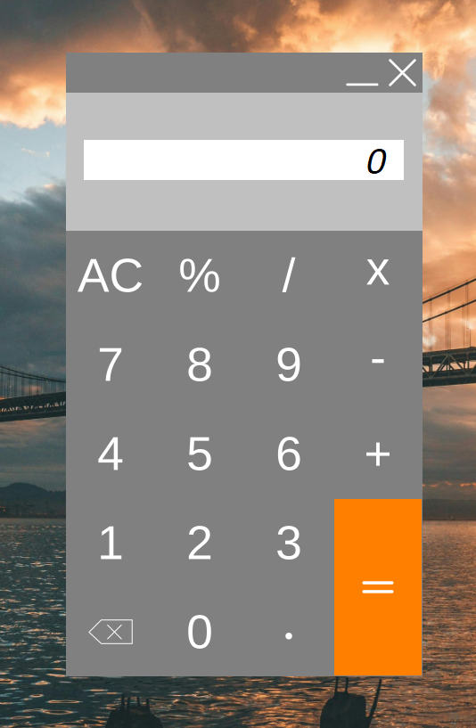

# 🧮 Calculator

A modern, efficient Windows Forms calculator application built with **C#**. Designed to provide a clean interface for standard arithmetic operations with comprehensive keyboard support.

---

## ✨ Features

- 🔢 **Standard Operations**: Perform addition, subtraction, multiplication, and division with ease.
- ➗ **Modulo Support**: Includes modulo (%) operation for advanced calculations.
- ⌨️ **Full Keyboard Support**:
  - **Numpad & Numbers**: Quick data entry.
  - **Enter**: Calculate result.
  - **Backspace**: Delete last digit.
  - **Esc**: Clear all (AC).
- 📜 **Calculation History**: View your current calculation steps in real-time.
- 🎨 **Modern UI**: Custom title bar with minimize/close buttons and draggable window.
- ⚡ **Responsive Design**: Button animation effects for better tactile feedback.
- 🛡️ **Error Handling**: Graceful handling of errors like division by zero.

## 🖼️ Screenshots

### Main Interface


---

## 🛠️ Technologies

- **.NET Framework**
- **Windows Forms (WinForms)**
- **C#**

## 📋 Requirements

- Windows Operating System
- .NET Framework 4.7.2 or higher
- Visual Studio 2019/2022 (for development)

## 🚀 Installation

1. **Clone the Repository**
   ```bash
   git clone https://github.com/Kaaner4mir/calculator.git
   cd calculator
   ```

2. **Build the Project**
   - Open `Calculator.sln` in Visual Studio.
   - Press **F5** to build and run the application.

## 📖 Usage

### Basic Calculations
- Use the on-screen buttons or your keyboard to input numbers.
- Press operators (`+`, `-`, `*`, `/`, `%`) to perform calculations.
- Press `=` or `Enter` to see the result.

### Keyboard Shortcuts
| Key | Action |
| :--- | :--- |
| `0-9` | Input Numbers |
| `+ - * /` | Standard Operators |
| `Shift + 5` | Modulo (%) |
| `Enter` | Calculate (=) |
| `Backspace` | Delete last digit |
| `Esc` | Clear All (AC) |

## 📁 Project Structure

```
calculator/
├── Calculator/              # Main source code
│   ├── Forms/               # UI Forms (Form1.cs)
│   ├── Program.cs           # Entry point
│   └── Images/              # Assets
├── Calculator.sln           # Solution file
└── LICENSE                  # MIT License
```

## 📝 License

This project is licensed under the MIT License. See the `LICENSE` file for details.

## 👤 Author

**Kaaner4mir**

- GitHub: [@Kaaner4mir](https://github.com/Kaaner4mir)

⭐ If you found this project helpful, please give it a star!
